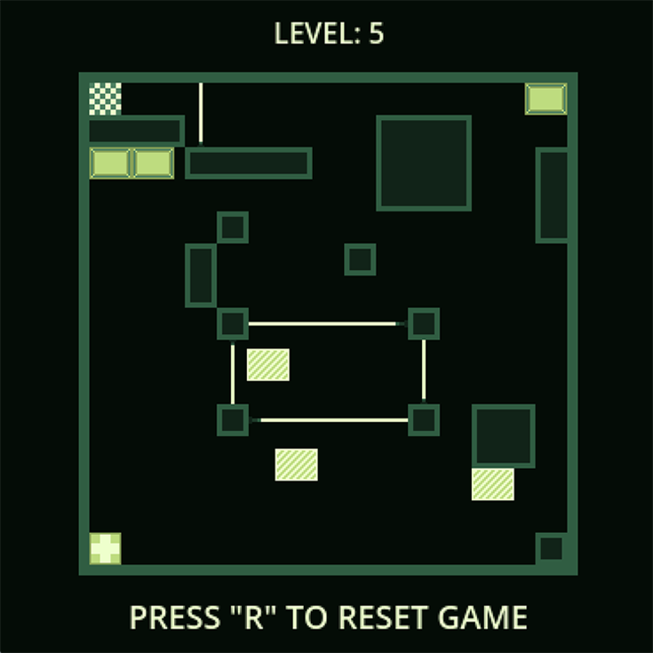
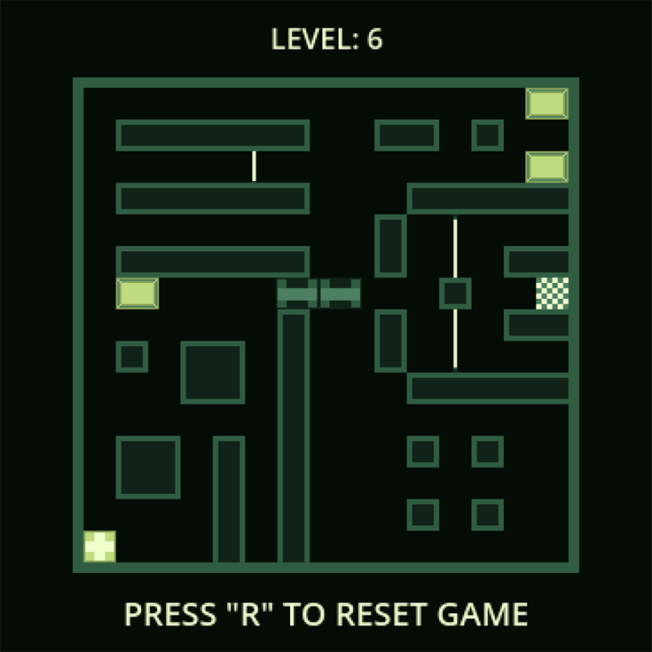
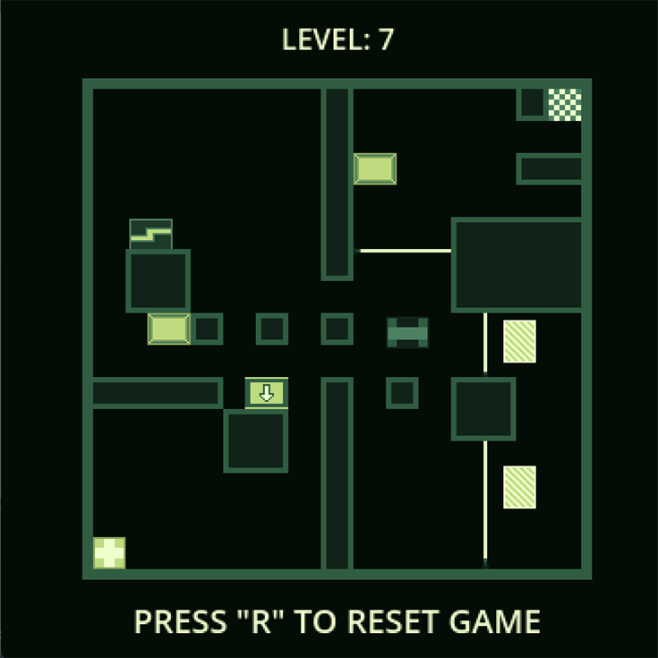
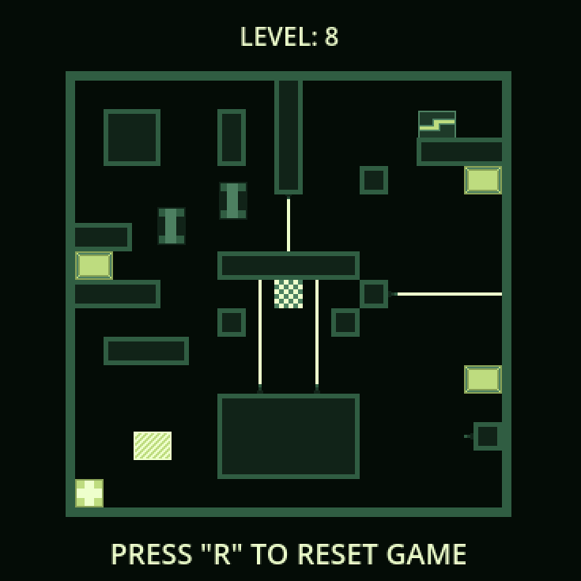
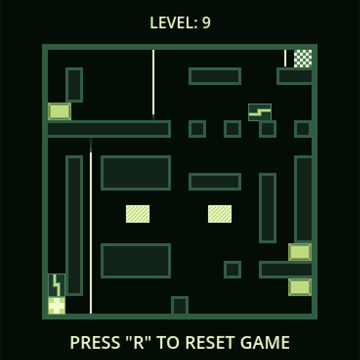
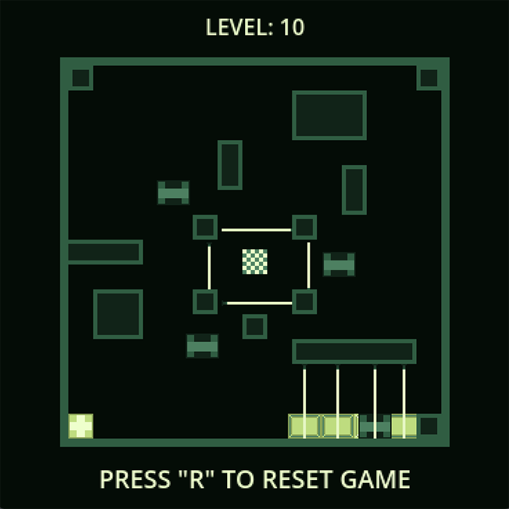

# Pixel Mania:

    
     
    <a href="https://cecherz.itch.io/pixel-mania">Play online</a>

# Deployment guide:

## Requirement 
- Project base on [Godot Engine](https://godotengine.org/).
- Game not running on mobile devices.

## How create new levels?
- Project includes components: that allow you to create your own levels using [Godot Engine](https://docs.godotengine.org/en/stable/). More info -> [CLICK](NEW_LEVEL_GUIDE.md)

# Screens:

    
    
    
    
    
    
    
    
    
    

# Changelog:
- **0.1 beta**: 
    - add level 2
- **0.2 beta**: 
    - add level 3 and 4 
    - add more music soundtracks
    - change player control speed
- **0.3 beta**:
    - add level 5
    - add sounds: die, promote, push
    - add start screen with level choice
- **1.0 beta**
    - add level 6 - 10
    - add gravity chest mechanics

# Credits

### Programming and level design:     
* [Kamil Cecherz](https://cecherz.pl/)

### Background music:
* [GregorQuendel](https://freesound.org/people/GregorQuendel/)

    #### Playlist:
    ---
    0. [Sześć Walców nr 1 – Maria Dolores Knoop – w opracowaniu na gitarę](https://freesound.org/people/GregorQuendel/sounds/729864/?)
    1. [Chopin - Nocturne Op. 27 No. 2](https://freesound.org/people/GregorQuendel/sounds/706660/)
    2. [Granados - Spanish Dance No. 2, Oriental](https://freesound.org/people/GregorQuendel/sounds/710599/)
    3. [Bach - The Well-Tempered Clavier - Book 1 - 1. Prelude C Major - BWV 846](https://freesound.org/people/GregorQuendel/sounds/710142/)
    4. [Debussy - Arabesque No. 1](https://freesound.org/people/GregorQuendel/sounds/706299/)
    ---

### Sounds:
* [qfox123](https://freesound.org/people/qfox123/sounds/462807/) - player touch laser beam
* [LittleRainySeasons](https://freesound.org/people/LittleRainySeasons/sounds/335908/) - end level sound
* [stulldude](https://freesound.org/people/stulldude/sounds/574909/) - touch activation plate